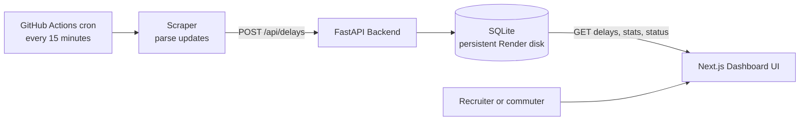

# Mumbai Local Train Delay Tracker

[](https://fastapi.tiangolo.com/)
[](https://nextjs.org/)
[](https://www.docker.com/)
[](https://docs.github.com/en/actions)
[](LICENSE)

A production-ready full-stack starter for tracking and visualizing Mumbai local train delays across the Central, Western, and Harbour lines.

## 🚀 Live Demo & Deployment

- **Live Dashboard (Vercel):** [Open dashboard](https://your-vercel-app.vercel.app)
- **Live API Swagger Docs:** [Open `/docs`](https://your-render-api.onrender.com/docs)

Replace these placeholders with the deployed Vercel and Render URLs after provisioning the services.

## Architecture & Data Flow



## Architecture

```text
.
├── backend/
│   ├── app/
│   │   ├── database.py        # SQLAlchemy engine/session setup
│   │   ├── main.py            # FastAPI application and API routes
│   │   ├── models.py          # DelayIncident ORM model
│   │   └── schemas.py         # Pydantic request/response schemas
│   ├── requirements.txt
│   └── scraper/
│       └── mock_scraper.py    # Mock announcement generator + ingestor
├── frontend/
│   ├── app/
│   │   ├── globals.css
│   │   ├── layout.tsx
│   │   └── page.tsx
│   ├── components/
│   │   └── dashboard.tsx
│   ├── lib/
│   │   ├── api.ts
│   │   └── types.ts
│   ├── package.json
│   ├── tailwind.config.ts
│   └── ...Next.js config files
└── README.md
```

## Backend

Tech stack: FastAPI + SQLAlchemy + SQLite

### Data model

`DelayIncident` fields:

- `id`
- `line` (`Central`, `Western`, `Harbour`)
- `direction` (`UP`, `DN`)
- `station`
- `affected_stretch`
- `delay_minutes`
- `priority`
- `announcement_text`
- `created_at`

### API endpoints

- `GET /api/delays?line=Central&limit=50`
	- Returns latest delay incidents (optionally filtered by line).
- `GET /api/status`
	- Returns status summary for each line (`Normal`, `Minor Delays`, `Major Disruptions`).
- `POST /api/delays`
	- Ingest a new delay incident.
- `GET /api/delays/stats`
	- Returns active delay count, average delay, worst-affected line, and stretch.
- `GET /api/lines/{line_name}`
	- Returns a detailed breakdown for `Central`, `Western`, or `Harbour`.

### Run backend

1. Create and activate a virtual environment:

```bash
cd backend
python3 -m venv .venv
source .venv/bin/activate
```

2. Install dependencies:

```bash
pip install -r requirements.txt
```

3. Start API server:

```bash
uvicorn app.main:app --reload --host 0.0.0.0 --port 8000
```

4. Optional: generate mock incidents:

```bash
python scraper/mock_scraper.py --count 10
```

## Quick Start with Docker

Build and start both services from the repository root:

```bash
docker compose up --build
```

The dashboard is available at `http://localhost:3000` and the API at `http://localhost:8000`. Seed the persistent database in a one-off container with:

```bash
docker compose exec backend python -m app.seed
```

The scheduled workflow in `.github/workflows/scrape_cron.yml` runs every 15 minutes. Configure the repository secret `BACKEND_API_URL` with the deployed backend base URL, such as `https://your-api.example.com`.

## Deploy It Yourself

### 1. Deploy the backend on Render

1. Create a new Render Blueprint and select this repository.
2. Render detects [render.yaml](render.yaml), installs `backend/requirements.txt`, and starts FastAPI with Uvicorn.
3. Set `CORS_ORIGINS` to the final Vercel dashboard URL.
4. The included 1 GB persistent disk stores SQLite at `/app/data/delay_tracker.db`.
5. Seed the database once from the Render shell with `python -m app.seed`.

### 2. Deploy the frontend on Vercel

1. Import the repository into Vercel and set the project root to `frontend`.
2. Set `NEXT_PUBLIC_API_BASE_URL` to the Render backend URL.
3. Deploy using the included [vercel.json](frontend/vercel.json) configuration.

### 3. Enable scheduled scraping

1. In the GitHub repository settings, add an Actions secret named `BACKEND_API_URL`.
2. Set its value to the Render backend base URL without a trailing slash.
3. The workflow runs at `*/15 * * * *` and can also be started manually from the Actions tab.

## Frontend

Tech stack: Next.js App Router + TypeScript + Tailwind CSS

### Features

- Dark dashboard UI with atmospheric gradient background
- Header with live indicator
- Summary cards for Western, Central, and Harbour lines
- Search and filter by line and station
- Live feed of delay incidents with station badges, delay tags, and timestamps
- Auto-refresh from backend every 15 seconds

### Run frontend

1. Install dependencies:

```bash
cd frontend
npm install
```

2. Configure API URL:

```bash
cp .env.local.example .env.local
```

3. Start frontend:

```bash
npm run dev
```

4. Open app:

`http://localhost:3000`

## Production notes

- Replace wildcard CORS in `backend/app/main.py` with explicit frontend domain(s).
- Swap SQLite with PostgreSQL for multi-instance deployments.
- Add authentication and role-based write access before exposing `POST /api/delays` publicly.
- Deploy frontend and backend behind HTTPS with environment-specific configs.

## Live Demo

- Frontend (Vercel): `https://your-vercel-app.example.com`
- Backend (Render): `https://your-render-api.example.com`

