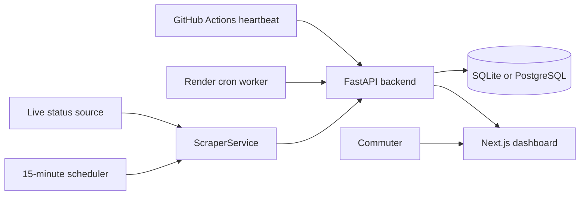

# Mumbai Local Train Delay Tracker

Production-ready full-stack observability for Mumbai suburban rail delays across the Central, Western, and Harbour lines.

[](https://fastapi.tiangolo.com/) [](https://nextjs.org/) [](https://github.com/lakshyakurup/mumbai-local-delay-tracker/actions/workflows/ci.yml)

## What is included

- FastAPI v2 API with CORS, rate limiting, Prometheus metrics, health probes, typed schemas, and SQLAlchemy persistence.
- Scraper service that parses JSON feeds and announcement text, classifies severity, and records updates every 15 minutes.
- Next.js command center with live line cards, delay observations, analytics trends, station-level metrics, and responsive styling.
- Docker Compose for local development, optimized backend/frontend images, Render Blueprint deployment, and GitHub Actions automation.
- Focused pytest and React Testing Library coverage for scraper logic, API behavior, and dashboard components.

## System flow


```mermaid
flowchart LR
    Source[Live status source] --> Parser[ScraperService]
    Cron[15-minute scheduler] --> Parser
    Actions[GitHub Actions heartbeat] --> API[FastAPI backend]
    Render[Render cron worker] --> API
    Parser --> API
    API --> DB[(SQLite or PostgreSQL)]
    API --> Dashboard[Next.js dashboard]
    Commuter[Commuter] --> Dashboard
```

## Repository map

```text
.
├── backend/
│   ├── main.py                         # FastAPI application bootstrap
│   ├── config.py                       # Environment-backed settings
│   ├── database.py                     # SQLAlchemy engine and sessions
│   ├── schemas.py                      # Pydantic API contracts
│   ├── models/database.py              # DelayRecord, LineStatus, StationMetric
│   ├── routers/
│   │   ├── delays.py                   # Delay CRUD, line status, scraper trigger
│   │   ├── stats.py                    # Summary and historical trends
│   │   └── health.py                   # Database-backed health endpoint
│   ├── services/
│   │   ├── scraper.py                  # JSON/text parser and persistence service
│   │   └── scheduler.py                # 15-minute APScheduler job
│   └── tests/
│       ├── test_api.py                 # FastAPI endpoint tests
│       └── test_scraper.py             # Parser and severity tests
├── frontend/
│   ├── app/
│   │   ├── page.tsx                    # Live command center
│   │   ├── analytics/page.tsx          # Historical analytics view
│   │   ├── lines/page.tsx              # Station-by-station view
│   │   └── layout.tsx                  # Global provider and navigation shell
│   ├── components/
│   │   ├── CommandCenter.tsx
│   │   ├── LiveIndicator.tsx
│   │   ├── LineCard.tsx
│   │   ├── LineStatusCard.tsx
│   │   ├── DelayChart.tsx
│   │   ├── LiveTicker.tsx
│   │   └── Navbar.tsx
│   ├── context/AppContext.tsx          # Shared polling state
│   ├── hooks/                          # Live delay and local storage hooks
│   ├── lib/api.ts                      # Typed API client
│   ├── utils/formatters.ts             # Delay, time, and severity formatters
│   └── __tests__/dashboard.test.tsx    # React Testing Library suite
├── database/schema.sql                 # Portable relational schema
├── .github/workflows/ci.yml            # Backend/frontend validation
├── .github/workflows/scraper-cron.yml # 15-minute production heartbeat
├── Dockerfile.backend                  # Multi-stage API image
├── Dockerfile.frontend                 # Standalone Next.js image
├── docker-compose.yml                  # Local full-stack orchestration
└── render.yaml                         # Render web service and cron worker
```

Additional governance and operating documents are maintained in [API_SPEC.md](API_SPEC.md), [ARCHITECTURE.md](ARCHITECTURE.md), [DEPLOYMENT.md](DEPLOYMENT.md), [SETUP_GUIDE.md](SETUP_GUIDE.md), [SECURITY.md](SECURITY.md), [CONTRIBUTING.md](CONTRIBUTING.md), [ROADMAP.md](ROADMAP.md), and [CHANGELOG.md](CHANGELOG.md).

## API surface

The production API is exposed by `backend.main:app`.

| Method | Endpoint | Purpose |
| --- | --- | --- |
| `GET` | `/health` | Database-backed service health |
| `GET` | `/metrics` | Prometheus metrics |
| `GET` | `/api/v2/lines/status` | Current Central, Western, and Harbour status |
| `GET` | `/api/v2/delays` | Recent delay records with line and time filters |
| `POST` | `/api/v2/delays` | Create a delay observation |
| `DELETE` | `/api/v2/delays/{record_id}` | Remove an observation |
| `GET` | `/api/v2/lines/{line}/stations` | Station reliability metrics |
| `GET` | `/api/v2/stats/summary` | Average delay and peak hour |
| `GET` | `/api/v2/stats/trends` | Daily historical delay buckets |
| `POST` | `/api/v2/scraper/run` | Authenticated one-shot scraper execution |

Interactive OpenAPI documentation is available at `/docs` when the API is running. Full request and response contracts are in [API_SPEC.md](API_SPEC.md).

## Local development

### Option 1: Docker Compose

```bash
git clone https://github.com/lakshyakurup/mumbai-local-delay-tracker.git
cd mumbai-local-delay-tracker
cp .env.example .env
docker compose up --build
```

Open `http://localhost:3000` for the dashboard and `http://localhost:8000/docs` for the API.

### Option 2: Native processes

Backend:

```bash
python3.12 -m venv .venv
source .venv/bin/activate
pip install -r backend/requirements.txt
uvicorn backend.main:app --reload --host 0.0.0.0 --port 8000
```

Frontend, in a second terminal:

```bash
cd frontend
npm install
NEXT_PUBLIC_API_URL=http://localhost:8000 npm run dev
```

The backend test suite runs with `pytest backend/tests -q`. The frontend checks run with `cd frontend && npm test` and `npm run build`.

## Configuration

Copy [.env.example](.env.example) and set values for the target environment:

| Variable | Required | Description |
| --- | --- | --- |
| `DATABASE_URL` | Yes | SQLite URL locally or PostgreSQL URL in production |
| `CORS_ORIGINS` | Yes | Comma-separated frontend origins |
| `NEXT_PUBLIC_API_URL` | Frontend | Public API base URL |
| `SCRAPER_SOURCE_URL` | No | JSON or text status source |
| `SCRAPER_TOKEN` | Production | Bearer token for scraper triggers |
| `RATE_LIMIT` | No | SlowAPI limit, default `120/minute` |

## Deployment

- **Render:** use [render.yaml](render.yaml) to provision the API web service and 15-minute cron worker. Set `CORS_ORIGINS`, `SCRAPER_TOKEN`, and the production database URL.
- **Vercel:** set the frontend root to `frontend` and configure `NEXT_PUBLIC_API_URL` with the Render API URL.
- **GitHub Actions:** configure `SCRAPER_URL` and `SCRAPER_TOKEN` repository secrets for the scheduled scraper heartbeat.
- **Scale:** use PostgreSQL for multiple API instances; SQLite is intended for local development or a single persistent-disk instance.

See [DEPLOYMENT.md](DEPLOYMENT.md) for the complete production checklist.

## Project status

Current release: **2.0.0**. See [CHANGELOG.md](CHANGELOG.md) for milestones and [ROADMAP.md](ROADMAP.md) for planned scaling work.

## License

This project is licensed under the MIT License. See [LICENSE](LICENSE).
